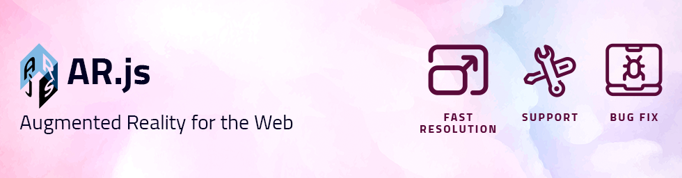

# SKKU-AR-TOUR
증강현실(AR) 기술을 활용한 학과 소개 웹 애플리케이션

## Demo

  

## Site
### [https://cmdev.skku.edu](https://cmdev.skku.edu) 
<i>(모바일 디바이스를 이용해서 접속을 권장합니다.)</i> 
<i>(Desktop 또는 Laptop을 이용하는 경우 버전 이슈로 인해 Firefox를 제외한 웹 브라우저에서 작동하지 않을 수 있습니다.)</i>

## Test Patterns

  

<i>(이 외의 패턴은 [./assets-patterns](https://github.com/comeducmd/skku-ar-tour/tree/master/assets/patterns)에서 확인 가능합니다.)</i> 

## Collaborators
  <table align="center">
    <th align="center"> 김서진 </th>
    <th align="center"> 김희동 </th>
    <th align="center"> 윤세린</th>
    <th align="center"> 장정윤 </th>
    <tr>
        <td align="center">
            
        </td>
        <td align="center">
            
        </td>
        <td align="center">
            
        </td>
        <td align="center">
            
        </td>
    </tr>
  </table>

## Code Convention
| 메시지 | 설명 |
|:---:|:---:|
| FEAT | 새로운 기능 추가 |
| FIX | 버그 수정|
| DOCS | 문서 추가 및 변경 |
| STYLE | 코드 포맷팅 |
| REFACTOR | 코드 리팩토링 |
| CHORE | 빌드 및 패키지 수정 |

## Reference
- https://ar-js-org.github.io/AR.js-Docs/
- https://github.com/AR-js-org/AR.js
- https://aframe.io/
